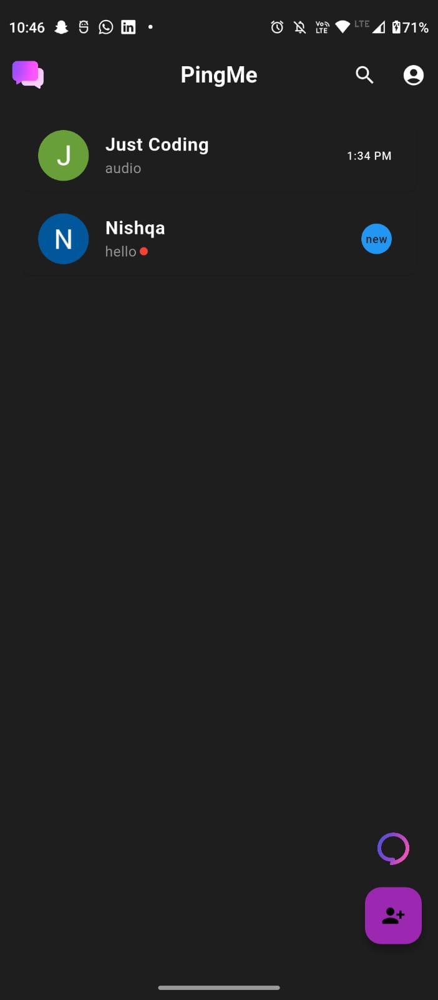
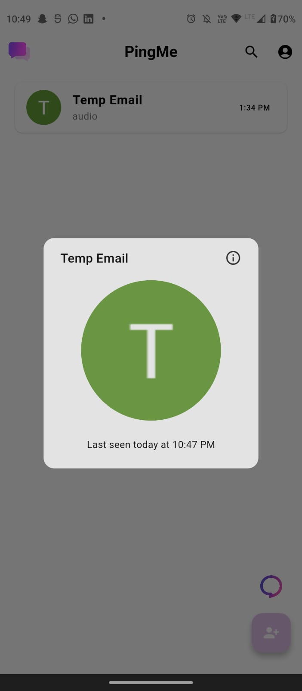
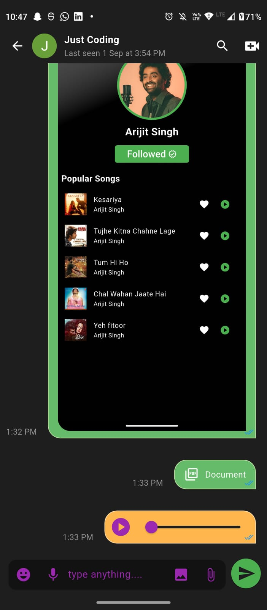
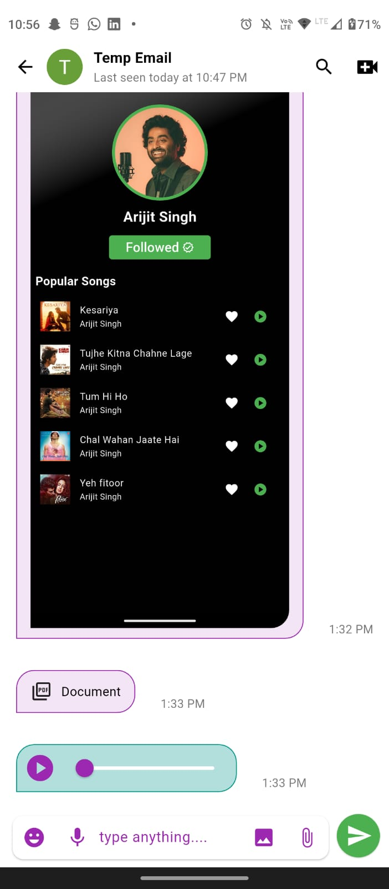
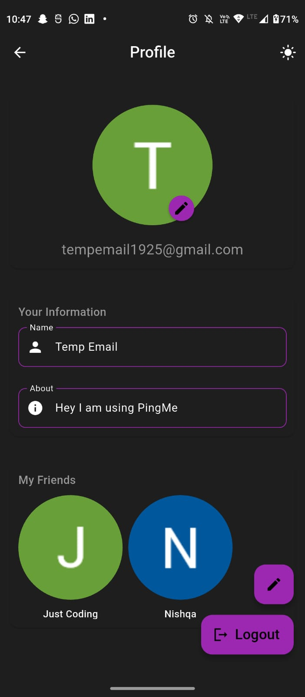
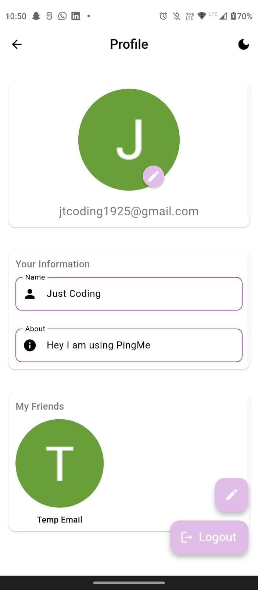
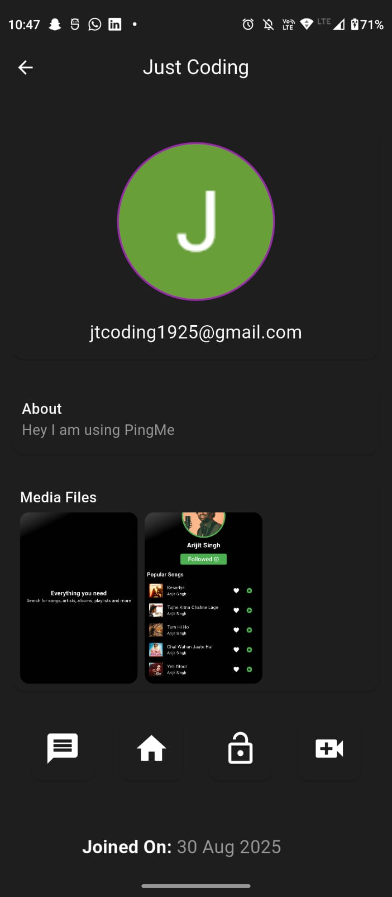
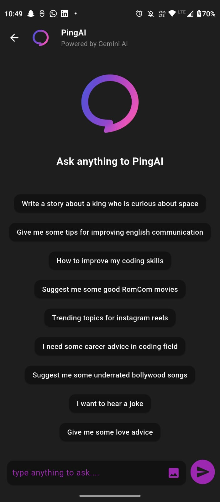
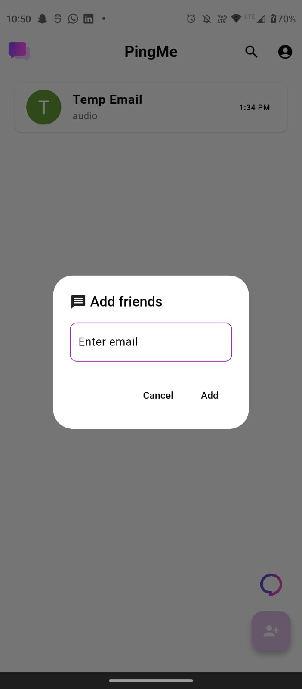

# 📱 PingMe

PingMe is a full-featured chat application built using **Flutter** and **Firebase**, offering real-time messaging, media sharing, and secure authentication via **Google Sign-In**. Inspired by WhatsApp, PingMe also introduces **PingAI**, an intelligent chatbot powered by the **Gemini API**, designed to assist users with smart replies, information lookup, and more.

---

## 🚀 Features

### 🔐 Authentication
- Google Sign-In using Firebase Authentication
- Secure user sessions
- Profile setup with display name and avatar

### 💬 Messaging
- One-to-one real-time chat using Firebase Firestore
- Typing indicators and message read receipts
- Push notifications via Firebase Cloud Messaging (FCM)
- Emoji support
- Voice notes support

### 📁 Media Sharing
- Send images, videos, documents, and voice notes
- In-app camera and gallery access
- Media uploads handled via **Cloudinary**
- Optimized delivery and transformation of media files

### 🧠 PingAI – AI Chatbot
- Smart assistant powered by Gemini API
- Context-aware responses
- Supports general queries, productivity tips, and casual conversation
- Seamlessly integrated into the chat interface

### 🔒 Chat Lock with Biometrics
- Lock specific chats for privacy
- Unlock chats using device biometrics (Fingerprint/Face ID)
- Prevents unauthorized access to sensitive conversations

---

## 🧰 Tech Stack

| Layer            | Technology                     |
|------------------|--------------------------------|
| Frontend         | Flutter                        |
| Backend          | Firebase Firestore             |
| Authentication   | Firebase Auth + Google Sign-In |
| Notifications    | Firebase Cloud Messaging (FCM) |
| Media Storage    | Cloudinary                     |
| AI Integration   | Gemini API                     |

---

## 📸 Screenshots

    

   

---
